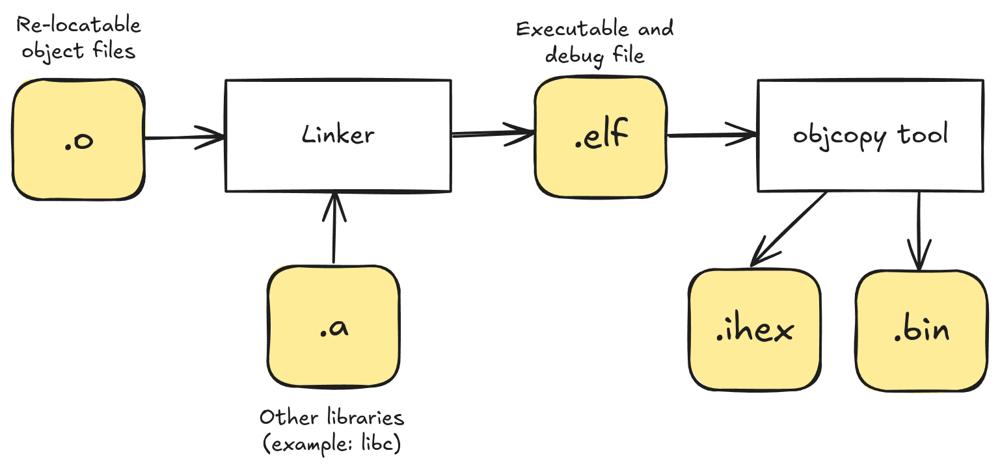
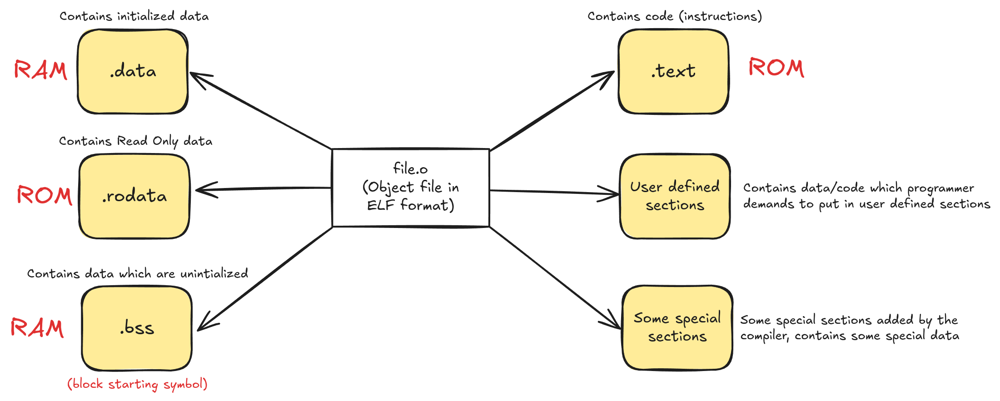
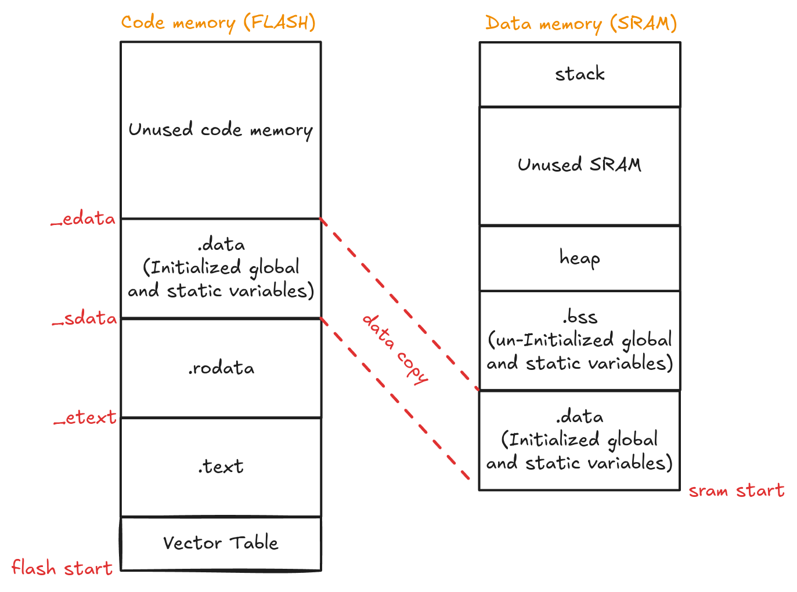

# LINKER 101

- **Cross Compilation:** Cross-compilation is a process in which the cross-toolchain runs on the host machine (PC) and creates executables that run on different machine(ARM)

- **Toolchains:**  is a collection of binaries which allows you to compile, assemble, link your applications. It also contains binaries to debug the application on the target. Toolchain also comes with other binaries which help you to analyze the executables.

GNU Tools (GCC) for ARM embedded processors is the best toolchain (it's free and open-source).

The important binaries:

- Compiler, linker, assembler: arm-none-eabi-gcc
- Elf file analyzer: arm-none-eabi-objdump, arm-none-eabi-readelf, arm-none-eabi-nm
- Assembler: arm-none-eabi-as
- Linker: arm-none-eabi-ld
- Format converter: arm-none-eabi-objcopy

## Build process

### High level 'c' code to machine codes


### Linking stage



in summary, it follows: Preprocessing -> Compilation -> Linking

## Compilation and compiler flags

Compile without link (`-c`): `arm-none-eabi-gcc -c -mcpu=cortex-m4 -mthumb main.c -o main.o`

If you would like to see assembly code, you could change the `-c` for `-S` and the `main.o` for `main.s`.

## Makefile

For automate the build process you should use a makefile like: [Makefile](app/Makefile)

### Some notes:

Dependency and Target:

    - `$^` - dependency
    - `$@` - target

```
main.o: main.c
    $(CC) $(CFLAGS) -o $@ $^
```

## Analyzing .o Files (Relocatable object files)

- file.o is in elf format (Executable and linkable format) 
- ELF is a standard file format for object files and executable files when you use GCC 
- A file format standard describes a way of organizing various elements(data, read-only data, code, uninitialized data, etc.) of a program in different sections.

To read object files, you can use `arm-none-eabi-objdump`

The `-h` display the content of the section headers, as example, you should run `arm-none-eabi-objdump -h file.o`.

To display the contents of all headers Display assembler contents of executable sections Display assembler contents of all sections, you should use `-d`, and you can redirect it to a file using `>` operator: `arm-none-eabi-objdump -d file.o > file_log`.
You also can use `-D` to get de assembler contents from all sections.

## Code and Data

- Instructions (codes) are stored in FLASH memory of the Microcontroller 
- Data (variables) are stored in main memory (RAM).



## Linker and Locator

 - Use the linker to merge similar sections of different object files and to resolve all undefined symbols of different object files. 
 - Locator (part of linker) takes the help of a linker script to understand how you wish to merge different sections and assigns mentioned addresses to different sections.



## Different data of a program and related sections

|---|---|---|---|---|
| Variable (data) | LOAD time | RUN time | Section | Note |
|---|---|---|---|---|
| Global Initialized          | FLASH | RAM         | .data    | Should be copied from flash to ram by startup code |
| Global uninitialized        |       | RAM         | .bss     | Startup code reserves space for this data in RAM and initializes to zero |
| Global static initialized   | FLASH | RAM         | .data    | Should be copied from flash to ram by startup code |
| Global static uninitialized |       | RAM         | .bss     | Startup code reserves space for this data in RAM and initializes to zero |
| Local initialized           |       | STACK (RAM) |          | Consumed at run time |
| Local uninitialized         |       | STACK (RAM) |          | Consumed at run time |
| Local static initialized    | FLASH | RAM         | .data    | Should be copied from flash to ram by startup code |
| Local static unintialized   |       | RAM         | .bss     | Startup code reserves space for this data in RAM and initializes to zero |
| All global const            | FLASH |             | .rodata  |  |
| All local const             | FLASH | STACK (RAM) |          | Treated as locals |

## .bss(block started by symbol) and .data section 

All the uninitialized global variables and uninitialized static variables are stored in the .bss section. 

Since those variables do not have any initial values, they are not required to be stored in the .data section since the .data section consumes FLASH space. Imagine what would happen if there is a large global uninitialized array in the program, and if that is kept in the .data section, it would unnecessarily consume flash space yet carries no useful information at all. 

.bss section doesn't consume any FLASH space unlike .data section 

You must reserve RAM space for the .bss section by knowing its size and initialize those memory space to zero. This is typically done in startup code 

Linker helps you to determine the final size of the .bss section. So, obtain the size information from a linker script symbols.

## Startup file

- The startup file is responsible for setting up the right environment for the main user code to run 
- Code written in startup file runs before main(). So, you can say startup file calls main() 
- Some part of the startup code file is the target (Processor) dependent 
- Startup code takes care of vector table placement in code memory as required by the ARM cortex Mx processor 
- Startup code may also take care of stack reinitialization 
- Startup code is responsible of data, .bss section initialization in main memory

**[Startup code example](app/startup.c)**

## Linker Script

- Linker script is a text file which explains how different sections of the object files should be merged to create an output file 
- Linker and locator combination assigns unique absolute addresses to different sections of the output file by referring to address information mentioned in the linker script 
- Linker script also includes the code and data memory address and size information. 
- Linker scripts are written using the GNU linker command language. 
- GNU linker script has the file extension of .ld
- You must supply linker script at the linking phase to the linker using -T option.

### Linker scripts commands

#### ENTRY

- This command is used to set the "Entry point address" information in the header of final elf file generated 
- In our case, "Reset_Handler" is the entry point into the application. The first piece of code that executes right after the processor reset. 
- The debugger uses this information to locate the first function to execute. 
- Not a mandatory command to use, but required when you debug the elf file using the debugger (GDB) 
- Syntax: ENTRY(_symbol_name_) 
- ENTRY(Reset_Handler)

#### MEMORY

- This command allows you to describe the different memories present in the target and their start address and size information 
- The linker uses information mentioned in this command to assign addresses to merged sections 
- The information is given under this command also helps the linker to calculate total code and data memory consumed so far and throw an error message if data, code, heap or stack areas cannot fit into available size 
- By using memory command, you can fine-tune various memories available in your target and allow different sections to occupy different memory areas 
- Typically one linker script has one memory command

Syntax:
```
MEMORY
{
    name(attr): ORIGIN =origin, LENGTH =len
}
```

| Attribute letter | Meaning |
| --- | --- |
| R   | Read-only sections                  | 
| W   | Read and write sections             | 
| X   | Sections containing executable code | 
| A   | Allocated sections                  |
| I   | Initialized sections                |
| L   | Same as 'I'                         | 
| !   | Invert the sense of any of the following attributes |

#### SECTIONS

- SECTIONS command is used to create different output sections in the final elf executable generated. 
- Important command by which you can instruct the linker how to merge the input sections to yield an output section 
- This command also controls the order in which different output sections appear in the elf file generated.
- By using this command, you also mention the placement of a section in a memory region. For example, you instruct the linker to place the .text section in the FLASH memory region, which is described by the MEMORY command.

Syntax: 

```
SECTIONS
{ 
    /* This section should include text section of all input files */
    .text: 
    { 
        //merge all .isr_vector section of all input files 
        //merge all .text section of all input files 
        //merge all .rodata section of all input files 
    }>(vma) AT>(lma) 
    
    /* This section should include data section of all input files */
    data: 
    { 
        //here merge all data section of all input files 
    }>(vma) AT>(lma) 
}
```

VMA: Virtual Memory Address
LMA: Load Memory Address

```
*(.text)
```

The *, stands for _all_.

#### Location counter (.) 

- This is a special linker symbol denoted by a dot'.' 
- This symbol is called "location counter" since linker automatically updates this symbol with location (address) information 
- You can use this symbol inside the linker script to track and define boundaries of various sections 
- You can also set location counter to any specific value while writing linker script 
- Location counter should appear only inside the SECTIONS command 
- The location counter is incremented by the size of the output section

#### Linker Script Symbols


#### KEEP


#### ALIGN
#### AT>

**[Linker Script code example](app/STM32F401xC.ld)**